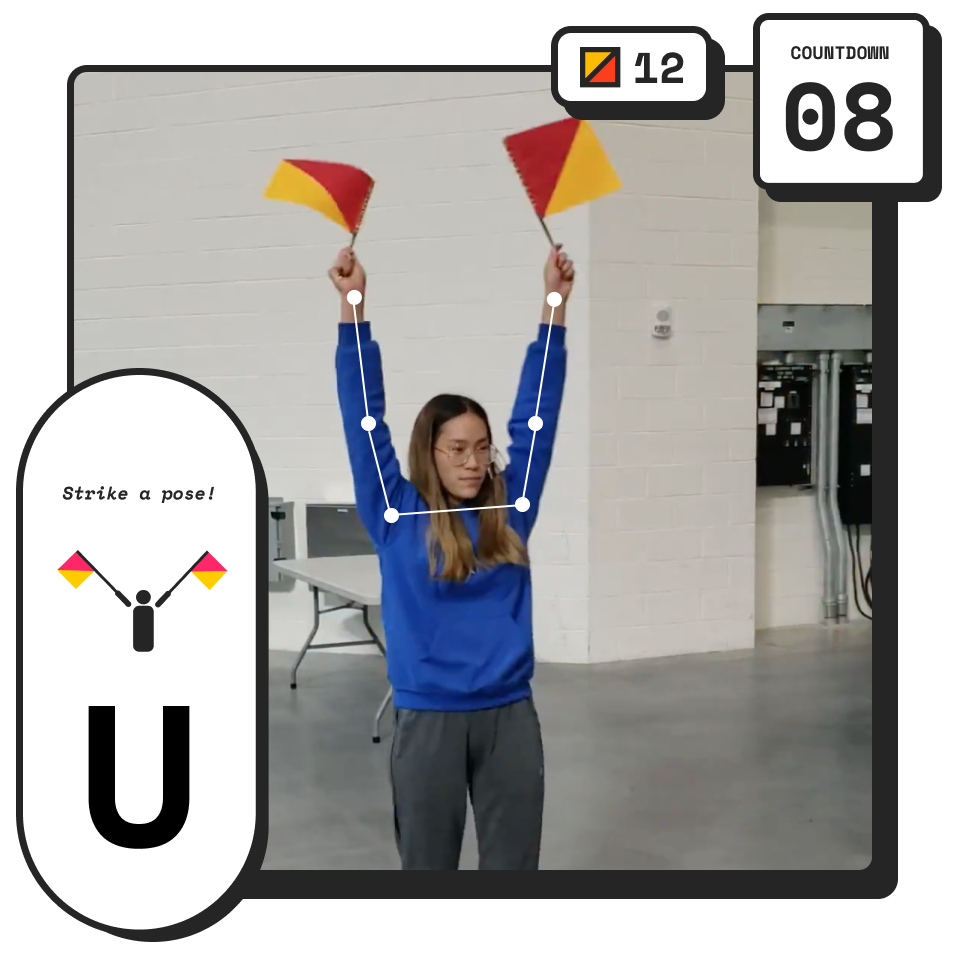
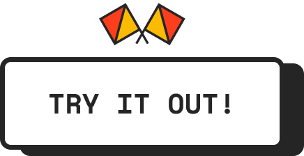

<h1 align="center">
  
 
  <h1 align="center">Say No More: Semaphore!</h1>
  <h2 align="center">Teaching flag-signaling with a pose-recognition game.</h2>
  

    
  

  

    
  

</h1>
  
**Say No More! is an award-winning AI game that aims to teach more people about flag-based maritime communication.**

It was initially created using the [ml5.js](https://ml5js.org/) library and the [poseNet()](https://ml5js.org/reference/api-PoseNet/) pose-recognition/pose-estimation model by [Amanda Yeh](https://amandayeh.com) and [Yana Gevorgyan](yg.is) during a hackathon, and later refined in early 2020 as a fully-fledged game.

🏆 Winner at UMBC Hackathon 2019

### How to Play Semaphore
1. Load the [game](https://ygev.github.io/semaphore).
2. Press **Start Game**.
3. Place your laptop on a tall surface and make sure your body is fully in the shot.
4. Ensure that the model recognizes your arms. If you see white outlines tracking your arms' movements, you're set.
5. **Wave your arms, as per the card with the stick figure, to start the game.**
6. **Try to imitate the poses that the game prompts you with! Get as many as you can in 20 seconds.**
  
  
